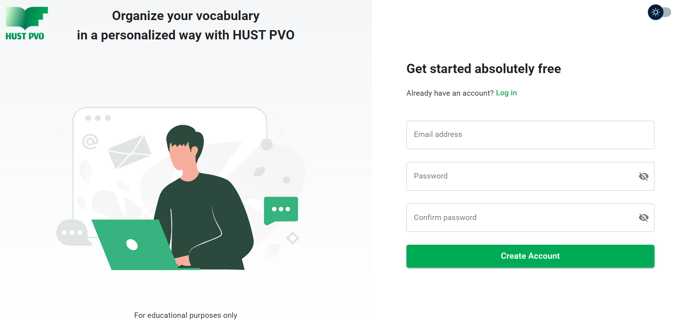
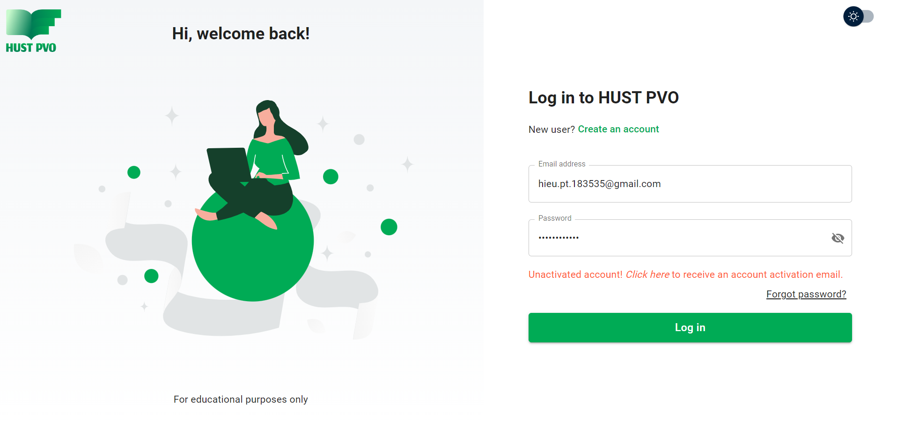
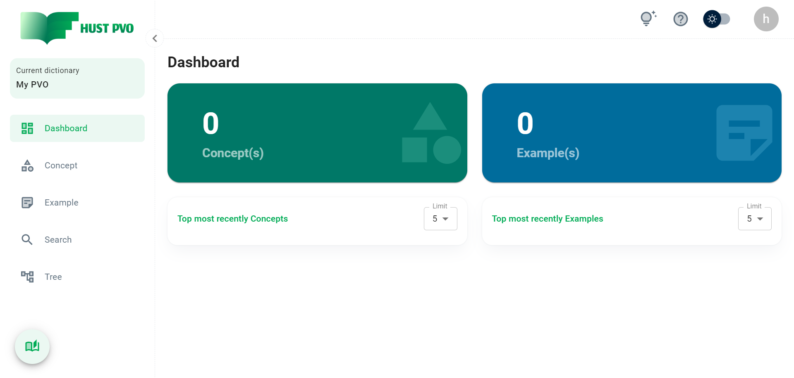
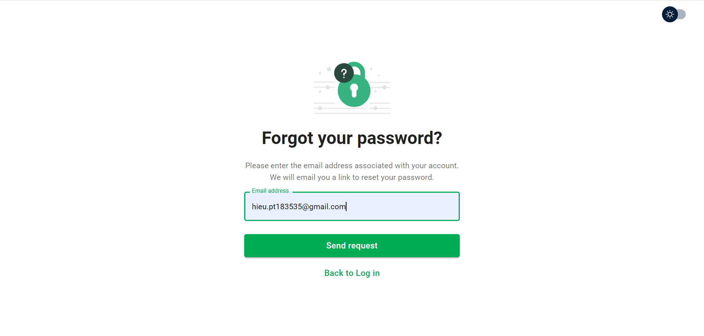

# Create Account

This section will guide you to register an account and log in to HUST PVO. There are also instructions on what to do when you forget your password.

## Register an account

You need to create an account to start using this webapp. HUST PVO requires users to use **email** to create an account.

Go to [https://www.hustpvo.xyz](https://www.hustpvo.xyz) and click ```Create an account```, or go to [https://www.hustpvo.xyz/register](https://www.hustpvo.xyz/register).



The application will give an error if the input is invalid such as: email already used, password malformed (password must be from 8-16 characters, contain at least 1 lowercase letter, 1 uppercase letter, 1 number, and 1 special character),...

If the registration is successful, you will receive a message asking you to check your email to activate your account.


You will receive an email similar to this. If you do not receive it, please check your spam folder. If you still don't see the email, please click ```Resend``` (you have to wait 2 minutes).


Click ```Verify account``` to activate your account.


## Login

Go to [https://hustpvo.site](https://hustpvo.site) and log in.

If you have not activated your account, you will receive an activation request. Click ```Click here``` to receive an activation email.



After successful login you will be redirected to Dashboard page.



:::tip Tip
If you are entering HUST PVO for the first time, you will have a **Dictionary** named ***My PVO*** available. From the following logins, the last accessed dictionary will be open by default.
:::
## Forgot password

If you forgot your password, enter your email and click ```Send request```.



You will receive an email similar to this. Click ```Reset password```.


## What's next?

The next section will give you an overview of HUST PVO.