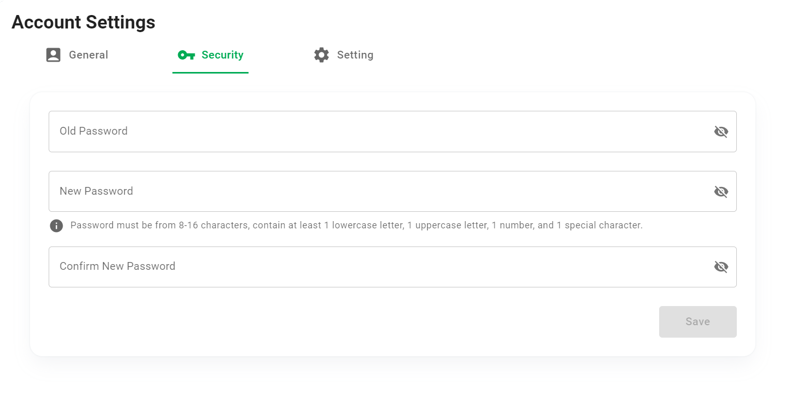
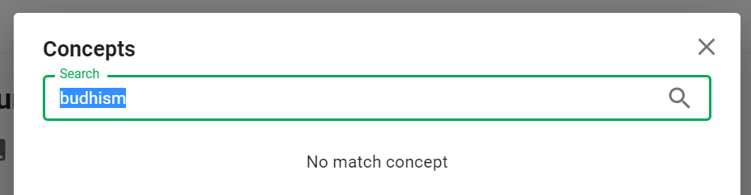
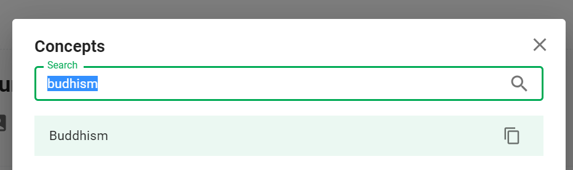
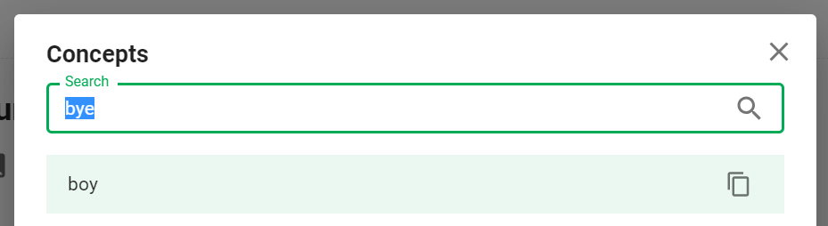

# Account Settings

This section describes the **Account Settings** feature.

Click ```Settings``` in the user menu.


## Overview


1. General: Change user information such as avatar, display name...
2. Security: Change password.
3. Setting: Other account settings.

## General tab


## Security tab



## Setting tab


Currently there is only 1 configuration at this tab, which is *"Use Soundex Search when searching for concepts"*.

>**Soundex** is a phonetic algorithm for indexing names by sound, as pronounced in English. The goal is for homophones to be encoded to the same representation so that they can be matched despite minor differences in spelling. ([Wikipedia](https://en.wikipedia.org/wiki/Soundex))

Soundex search is an **advanced search configuration**, which helps you to search for concepts even if you don't remember the concept clearly and enter a few characters wrong in the search box.

Here is an example of this feature. Suppose in your dictionary there is a concept of *"Buddhism"*, but when you search you remember wrongly and type *"Budhism"*.

If you uncheck the ```Use Soundex Search...``` checkbox, you will not find any concept that matches the search keyword *"Budhism"*.



When you check the ```Use Soundex Search...``` checkbox and search again, you will see the concept of *"Buddhism"* in the search results.



Soundex search is **not good for all cases**. You will probably get irrelevant search results. Here is an example when you search for *"bye"* while your dictionary doesn't have *"bye"*, but has *"boy"*.




