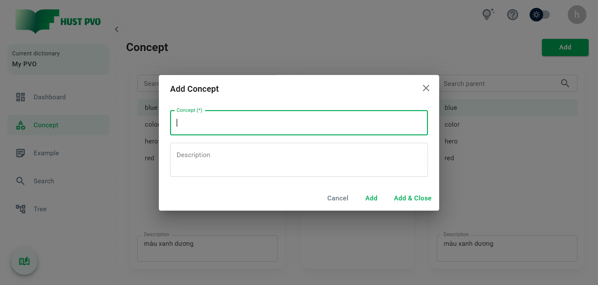
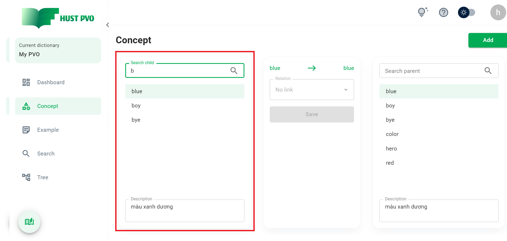

# Concept

This section describes the **Concept** screen.

## Overview


1. **Add a new concept** to the current dictionary.

2. Search box and **child concept** search results.

3. Search box and **parent concept** search results.

4. Combobox to select and save the **link between child concept and parent concept**.

:::tip Tip
**Child concept** and **Parent concept** are both concepts. We call it **child** or **parent** depending on the direction of the link.
:::

## Add a new concept



Enter the form, where the Concept field is required. In addition, concepts are not allowed to overlap in a dictionary.

:::tip Tip
The Concept field is **automatically focused** to help you enter data quickly.
:::

Click ```Add & Close``` to add the concept and close the dialog box.

Click ```Add``` to add the concept and refresh the dialog to continue adding. This is a useful feature that helps you quickly add a bunch of concepts.

:::tip Tip
A concept after successfully added will **automatically appear** in **the child concept search**, helping you quickly create links between concepts.
:::

## Searching for a concept

Enter a search keyword in the search box for **child concept** or **parent concept**. A concept is considered a match if it contains the search string.

:::tip Tip
The first matching concept will be **automatically selected**.
:::

:::tip Tip
HUST PVO provides an advanced configuration called **Soundex search**. By default this configuration is disabled. You can enable it at Account Settings. Details of this feature will be introduced later.
:::



If there aren't any concepts that match, you can instantly add the search string to a new concept by clicking ``Add`` (see image below).


## Establish links between concepts

After you have selected the child concept and the parent concept, you can establish the link between them. Note that the link type combobox will be disabled if the child concept or parent concept is not selected, or the child concept is the same as the parent concept.

:::tip Tip
*No link* is not actually a type of link. It is used to **remove** the link between two concepts. *No link* is the **default** relationship between two concepts.
:::


After choosing the link type, you need to click ```Save``` to save the settings. The ```Save``` button is disabled by default and is only activated if the type of association between the two concepts changes.

:::danger Note

You cannot create circular links. That is, if child concept A links to parent concept B, you cannot create a link from B to A.

:::


If you click ```Change```, the old link from A to B will be deleted and the new link from B to A will be added.

## Other actions

Right-click a concept in the search list to open the context menu.


1. **Add example**: navigate to the example screen, and the selected concept is automatically displayed in the search box linked concept.
2. **View tree**: navigate to the view tree, and display the tree structure of the selected concept.
3. **Edit concept**
4. **Delete concept**


