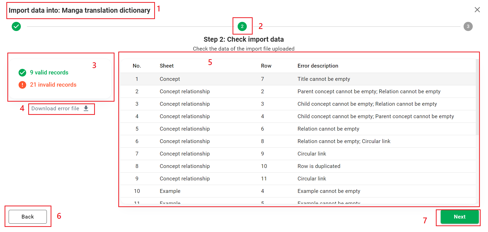

# Dictionary

This section describes the **My Dictionaries** screen. This feature allows you to manage your vocabulary dictionaries.

Click the ```Current dictionary``` area to open the **My Dictionaries** screen.


If you have collapsed the sidebar, you can click the ```Dictionary``` button in the left menu bar, or click the ```Current dictionary``` area in the header bar.


## List of dictionaries

Each dictionary in the list is displayed with its name and last accessed time.


By default, the list is sorted by when it was last accessed (new to old). Alternatively, you can choose to sort by dictionary name.

## Create a new dictionary

By default, HUST PVO has created a dictionary for you called *PVO*. You can create more dictionaries depending on your personal needs.

Click the ```Create``` button to open the ```Create Dictionary``` dialog box.


The ```Dictionary name``` is a required field. You cannot create 2 dictionaries with the same name.

In combobox ```Clone Data From```, you can select a source dictionary to **copy data** from to the new dictionary.

## Actions with dictionary

At any dictionary item, click the icon in the top right corner to open the menu.


1. Load: Access to dictionary to use.
2. Edit: Edit dictionary name.
3. Import: Import data from excel into dictionary.
4. Export: Export dictionary data to excel file.
5. Transfer: Copy the data of this dictionary, transfer and merge the existing data of another dictionary.
6. Delete: Clear data or delete dictionary.

### Load dictionary

Click ```Load``` in the menu, or double-click a dictionary item to open it as Current dictionary.

### Edit dictionary

Click ```Edit``` in the menu to open the dialog box. 
Enter the new dictionary name (the name cannot be left blank and cannot be the same as the name of the existing dictionary).

### Import data

Click ```Import``` in the menu to open the Import screen. The Import process consists of 3 steps.

:::danger Note
If the import is successful, all existing data of the dictionary will be deleted.
:::

#### Step 1 - Select import file


1. The name of the dictionary you are working with.
2. Current step.
3. Number of valid and invalid records.
4. Download error file.
5. Description table of invalid records.
6. Go back to step 1.
7. Go to next step.

The data in the imported file will be checked by HUST PVO for validity.

If there are any invalid records, HUST PVO displays a description on the table, and allows the user to download the error file.


To import, you need to **download the import template file provided by HUST PVO** and put the data in the file. Or you can use an **exported data file using HUST PVO's Export feature**.

:::danger Note
If you **do not** use the excel file that HUST PVO provides, we cannot process its data. You will get the error message: *"Invalid file upload"* when you proceed to step 2.
:::

HUST PVO provides an import template file in excel format. This file has a built-in structure to help you import data quickly, as well as so that HUST PVO can easily handle when you import.


The image below is an example of data entry in the import template file


HUST PVO only accepts files in excel format, less than 5.2 MB in size and must be a file provided by HUST PVO.


Click ```Next``` to go to step 2.

#### Step 2 - Check import data



1. The name of the dictionary you are working with.
2. Current step.
3. Import template download button.
4. File upload area.
5. Go to next step.

If there are any invalid records, HUST PVO displays a description on the table, and allows the user to download the error file.

The image below is an example of an error file. Error rows will be highlighted in red and accompanied by a description of the error in the last column.


:::tip Tip
You can fix the error file, and use the same file to import again (No need to change the color format of the error row or delete the error description in the last column).
:::

Click ```Next``` to import.

If the dictionary you are working on has data, a message dialog box will appear asking you to confirm. Click ```Accept continue``` to delete the old data and import the new data.


#### Step 3 - View import result

The result number of successfully imported records will be displayed on the screen.


### Export data

Click ```Import``` in the menu to open the Export Options dialog.

Click ```Download``` to download an excel file containing the exported data.

Click ```Send to email``` to ask HUST PVO to send the exported file to your email.


### Transfer

Click ```Transfer``` in the menu to open the Transfer dialog.


You need to select a destination dictionary. 

Suppose the source dictionary is A, the destination dictionary is B. The data from A including concepts, examples, concept - concept associations, example - concept associations will be copied to dictionary B. These data will be merged with the data already in B. 

For example, A contains concept ***a1*** associated with concept ***a2***, B contains concept ***a1*** associated with concept ***b2***, B does not contain concept ***a1***. After transferring data from A to B, B contains concept ***a1*** associated with concept ***a2*** and concept ***b2***.

HUST PVO allows you to choose whether to delete the destination dictionary data before receiving the data transferred from the source dictionary.

### Delete

Click ```Delete``` in the menu to open the Delete Options dialog.


You can choose ```Clear data``` (to empty the dictionary) or ```Delete dictionary```. Note that you **cannot delete the Current dictionary** (but you can delete its data).

If the dictionary has data, you'll see a warning dialog.


Click ```Delete``` to confirm the action, or click ```Cancel``` to cancel the action.