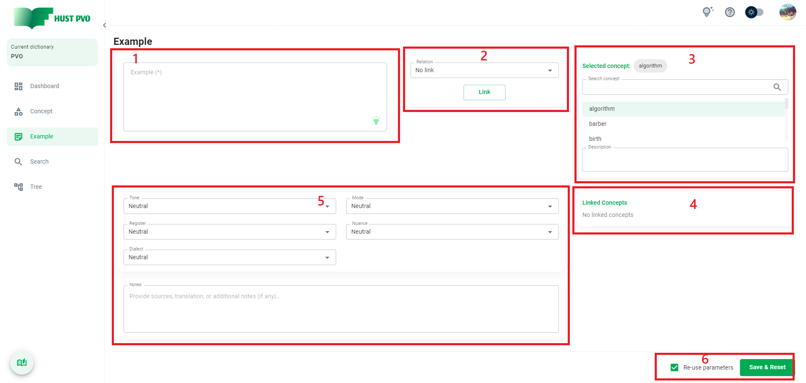
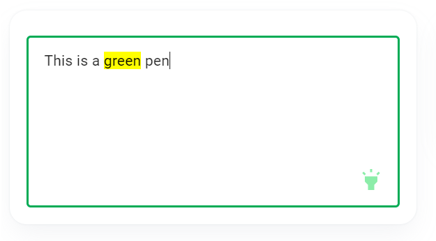
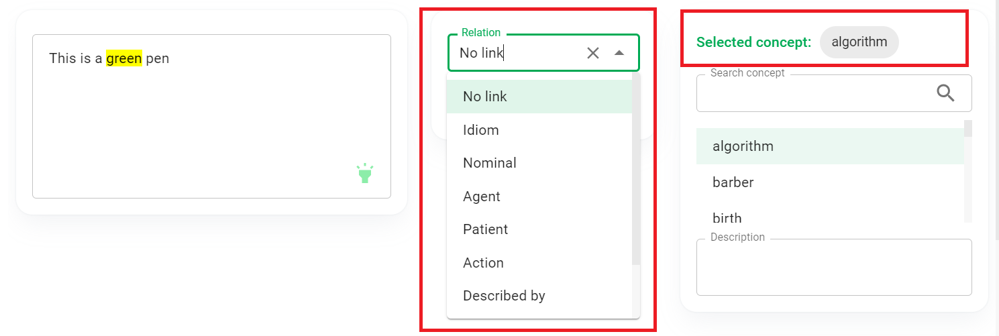
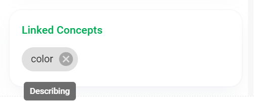

# Example

This section describes the **Example** screen.

## Overview



1. Example content.
2. Combobox allows to choose the type of association between example and concept.
3. Search box and concept search results.
4. List of linked concepts.
5. Attributes of examples and notes.
6. ```Save``` button and checkbox to remember parameters

## Example content

The Example content is a required field. The maximum length of the example content is 1000 characters. You need to **highlight** part or all of the content for example. 

You can't add 2 duplicate examples. Two examples are considered duplicate if they match both the content and the highlighted part.

:::tip Tip
The Example field is **automatically focused** to help you enter data quickly.
:::



## Establish links between example and concept

After you have selected the concept in the search results list, you can choose the type of association between the example and the concept.

:::tip Tip
*No link* is not actually a type of link. It is used to **remove** the link between an example and a concept. *No link* is the **default** relationship.
:::



Click the ```Link``` button, the concept will be displayed in the **linked concept list**. If you hover a concept in this list you will see the established relationship.



To edit an established link, you can perform a concept search again or click on the corresponding concept in the list of linked concepts. Then you change the link type and click ```Link``` button to temporarily save the settings. You can change the link type to ***No link*** to remove the link.

## Attributes of examples and notes

You can choose the tone, mode, register, nuance and dialect of the example. These attributes help indicate when you should use the example in practice.

**Tone** values include: *Neutral (**default**), Informal, Formal, Slightly informal, Slightly formal*.

**Mode** values include: *Neutral (**default**), Spoken, Written*.

**Register** values include: *Neutral (**default**), Academic, Literature, Business, Law, Journalism, Medicine, IT, Other (Add a more specific description in the note field)*.

**Nuance** values include: *Neutral (**default**), Old fashioned, Humorous, Oft positive, Oft negative*.

**Dialect** values include: *Neutral (**default**), American, British, Other (Add a more specific description in the note field)*.

In addition to the above attributes, you can provide other descriptions in the **Notes** field, such as source, translation, etc.

## Save & Reset

Before saving, you can choose to check or uncheck the ```Re-use parameters``` checkbox. Then click ```Save & Reset``` to add the example.

If the ```Re-use parameters``` checkbox is checked, the parameters you have set: tone, mode, register, nuance, dialect and notes will be preserved when the form is reset. Otherwise, all parameters will be reset to default.

