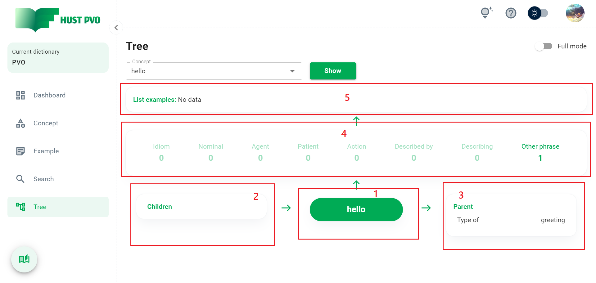
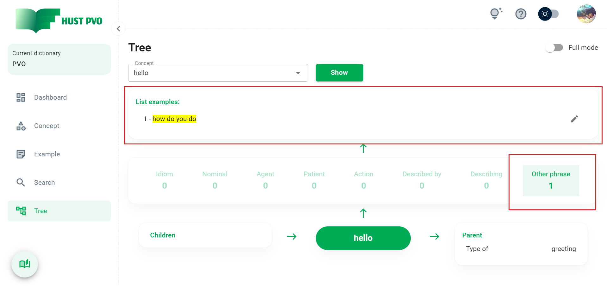
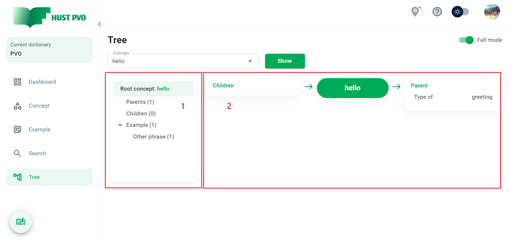
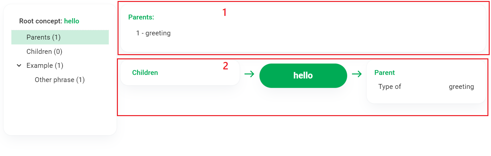
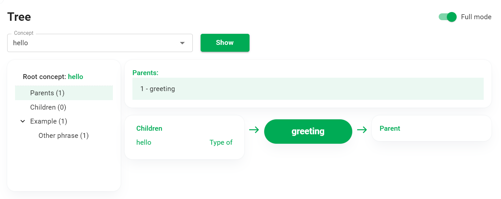
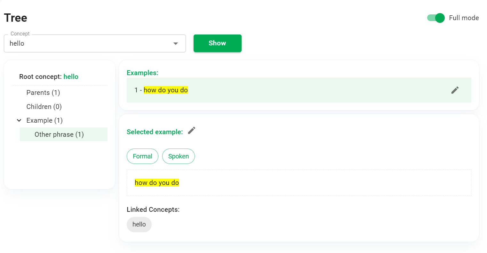

# Tree

This section describes the **Tree** screen. This feature allows you to view the **Concept tree structure**. 

## Overview

Enter or select a concept (call this the **Root concept**) in the ```Concept``` combobox. Click ```Show``` to display the corresponding Concept tree.

A **Concept tree** consists of a root concept, child concepts, parent concepts, and linked examples.

HUST PVO provides 2 viewing modes: **simple mode** and **full mode**.

## Simple mode



1. Root concept.
2. List of child concepts of root concept.
3. List of parent concepts of root concept.
4. List of relationship types with example.
5. List of examples corresponding to the selected relationship.

Click on a relationship in the list, you will see the corresponding list of examples appear. Click the pencil icon to view, edit, delete an example.



:::tip Tip
In the list of child concepts and parent concepts, you can click on any concept to select it as the **Root concept** and see the tree structure of that concept.
:::

## Full mode

In full mode view, the screen consists of 2 parts: directory tree structure and directory content.

### Root folder

The image below is the screen when you are in the **Root concept** folder.



1. Directory tree structure
2. Directory content

### Parents and Children folder

When you choose to view the **Parents** or **Children** folder, the displayed result will be similar to the image below.



:::tip TIP
If you click on a concept in **(1)**, the concept-concept network in (2) will change accordingly (**without changing the Root concept**).
:::

For example, the image below is the result when you click on the *greeting* concept in the Parent folder. The *greeting* concept-concept network is displayed, while the Root concept remains *hello* (root concept will be marked with green in concept-concept network).



:::tip TIP
If you click on a concept in **(2)**, the **Root concept** will be **changed accordingly** (same as in simple mode view).
:::

### Example folder

Click on a subfolder of the Example folder, the corresponding list of examples will appear. 

Click an example to see details. 

Click the pencil icon to edit or delete the example.




