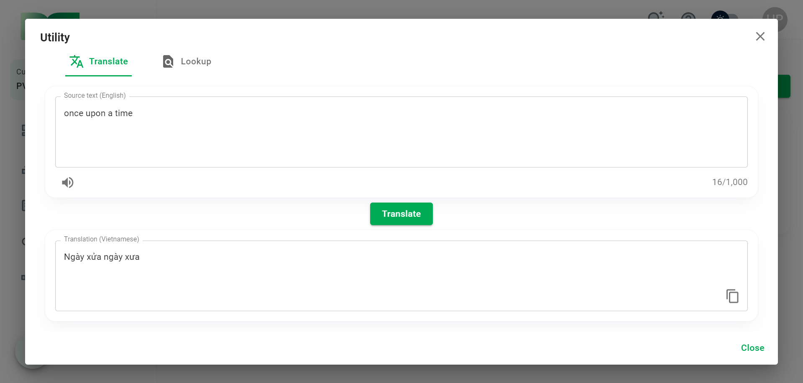
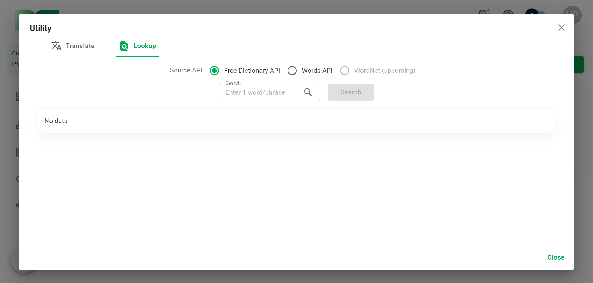
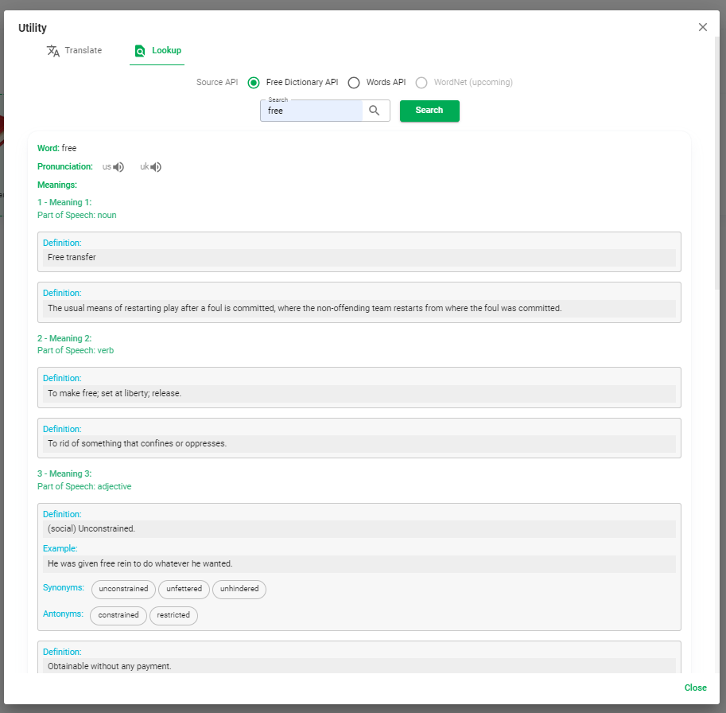

# Utility

This section describes the utility features of HUST PVO.

Click the ```Utility``` button on the Header bar to open the Utility dialog box.


Currently HUST PVO provides convenient features including: translation, text-to-speech, lookup support dictionaries.

## Translation and Text-to-speech



Enter text in the ```Source text``` box. Click ```Translate``` to translate the text, click the ```speaker icon``` to hear the voice read the text.

## Lookup dictionary



HUST PVO uses resources from the [Free Dictionary API](https://dictionaryapi.dev/), [Words API](https://www.wordsapi.com/) ([WordNet](https://wordnet.princeton.edu/) will be available in the future) as a reference source for users.

Enter a word or phrase and click ```Search``` to get data from the selected reference source.

The image below is the search result for the keyword *free* with the source **Free Dictionary API**. You will get pronunciations, definitions, examples, synonyms, antonyms... of the word *free*.



Or with **Words API**, you will get results like below with the keyword *hello*:


:::tip TIP
You can click on a definition line, an example line or any word in the linked word group to **copy**.
:::
