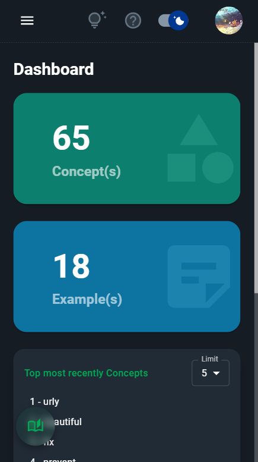

# Progressive Web App

## Responsive web design

HUST PVO is built with responsive design. You can use it on desktop computers, laptops, tablets, mobile phones... with good interface and user experience.




## Progressive Web App

HUST PVO is a [Progressive Web App](https://developer.mozilla.org/en-US/docs/Web/Progressive_web_apps).

>A progressive web app (PWA) is an app that's built using web platform technologies, but that provides a user experience like that of a platform-specific app.
>
>Like a website, a PWA can run on multiple platforms and devices from a single codebase. Like a platform-specific app, it can be installed on the device, can operate while offline and in the background, and can integrate with the device and with other installed apps. ([mdn web docs](https://developer.mozilla.org/en-US/docs/Web/Progressive_web_apps))

### Desktop

When using a computer, on the browser, you can install the HUST PVO app. 


Then you can use HUST PVO as a desktop application.


### Mobile

Access: https://www.hustpvo.xyz. Select ```Add to Home Screen```.


Then you can use HUST PVO as a mobile application.


