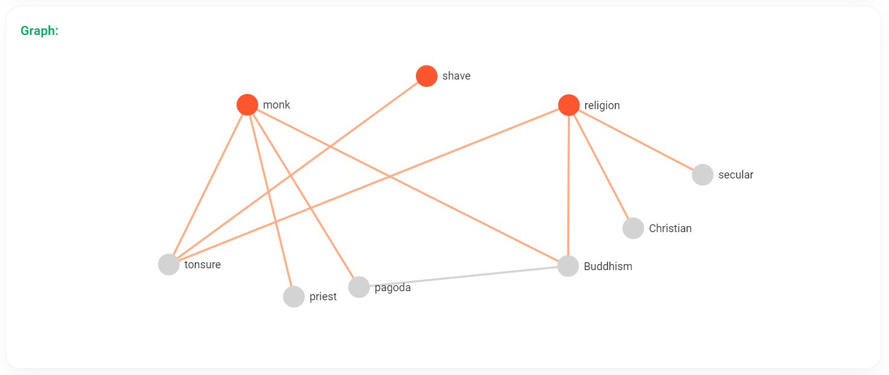
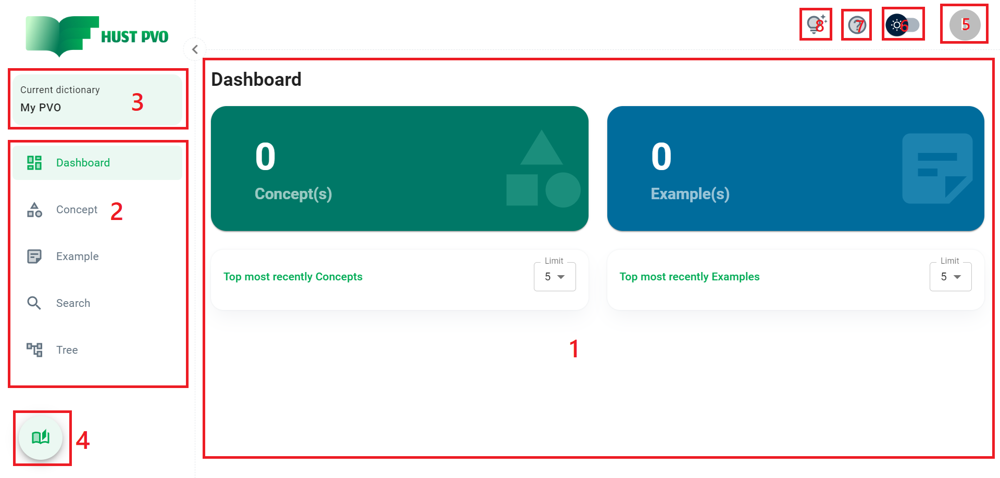
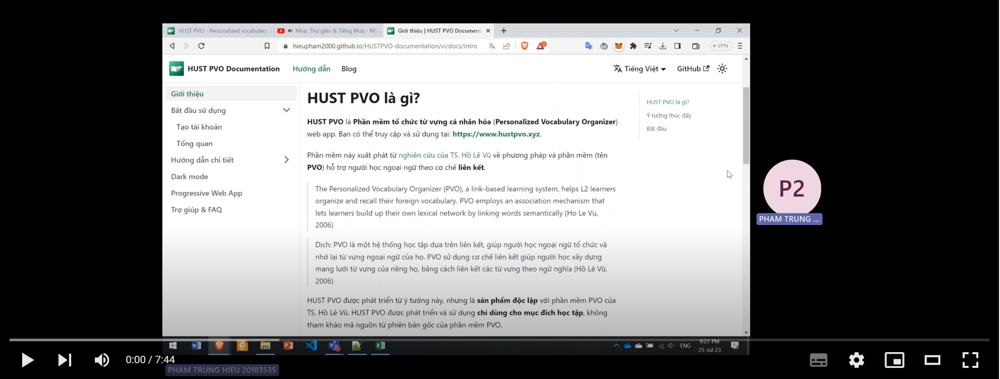
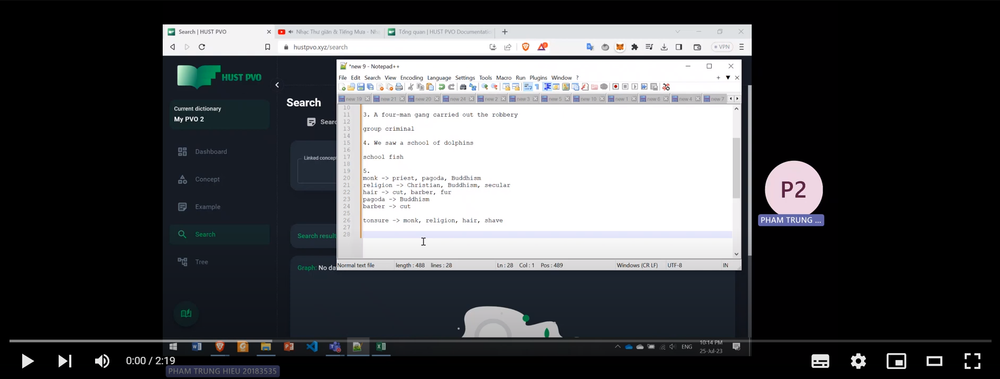

# Tổng quan

Phần này giới thiệu **các khái niệm nền tảng và tính năng chính** của HUST PVO.

## Khái niệm nền tảng

Có 3 khái niệm nền tảng trong HUST PVO: **Concept**, **Example** và **Dictionary**.

1. **Concept** (Từ, khái niệm) ở đây là 1 từ, 1 cụm từ hoặc 1 nhóm các từ, được sử dụng để đại diện 1 ý nghĩa nhất định. Ví dụ, 1 từ đơn như *free*, *freedom*, *hero*,... 1 cụm từ như *look after*,... hay 1 nhóm từ như *reason-cause*,...

2. **Example** (Ví dụ) đây là 1 cụm từ, 1 câu hoặc 1 đoạn mô tả cách sử dụng từ vựng với một ý nghĩa cụ thể. **Example** sẽ có các thuộc tính ***tone***, ***mode***, ***register***, ***nuance*** và ***dialect*** tương ứng để xác định ngữ cảnh để sử dụng. Ví dụ: *shake a leg* là một **example** trong đó tone là *informal*, nuance là *old-fashioned* và mode là *spoken*.

3. **Dictionary** (Từ điển) là nơi lưu trữ **concept** và **example**. Một tài khoản người dùng có thể tạo nhiều từ điển cho các mục đích khác nhau. Ví dụ người dùng A tạo 1 từ điển lưu trữ từ vựng giao tiếp và 1 từ điển luyện thi IELTS.

HUST PVO là hệ thống học tập dựa trên liên kết, giúp người học học từ vựng theo cơ chế liên kết. Do đó, HUST PVO cho phép người dùng tạo hai loại liên kết ngữ nghĩa:

1. Liên kết giữa các concept (*Association*, *Type of*. Mặc định là *No link*).

2. Liên kết example và concept (*Idiom*, *Nominal*, *Agent*, *Patient*, *Action*, *Described by*, *Describing*, *Other phrase*. Mặc định *No link*).

Tạo liên tưởng, liên kết thích hợp giúp tăng khả năng nhớ từ, tăng hiệu quả học và sử dụng từ.

Một ví dụ về liên kết concept và kết quả khi truy xuất trên HUST PVO:

## Chức năng

Đây là bố cục chính của HUST PVO:

1. Khu vực làm việc chính
2. Sidebar: Dashboard, Concept, Example, Search, Tree
3. Quản lý từ điển
4. Xem tất cả concept trong từ điển hiện tại
5. Thiết lập tài khoản
6. Bật/tắt Chế độ tối (Dark mode)
7. Trợ giúp
8. Tính năng tiện ích: Dịch (Translate), Chuyển văn bản thành giọng nói (Text to speech), Tra cứu nguồn tham khảo (Look up) 

## Bắt đầu sử dụng

1. Video: Hướng dẫn Thêm example

2. Video: Hướng dẫn Tìm kiếm concept theo liên kết

## Điều gì tiếp theo?

Phần tiếp theo sẽ hướng dẫn bạn từng tính năng của HUST PVO.

