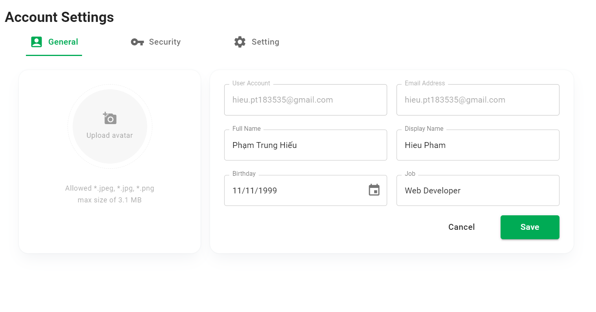
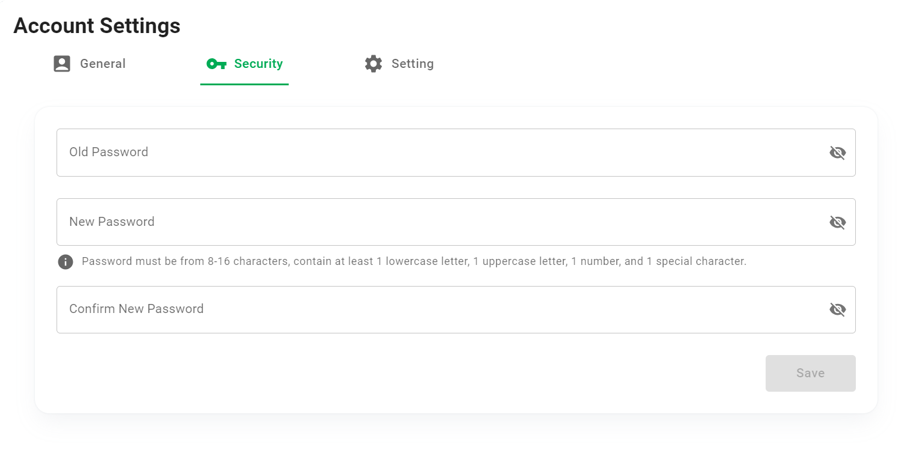
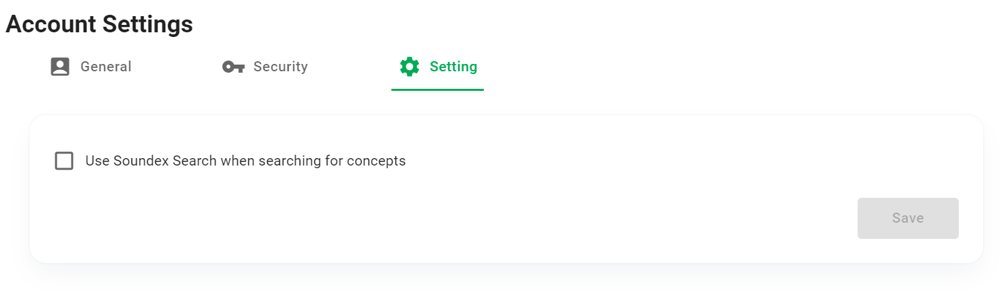
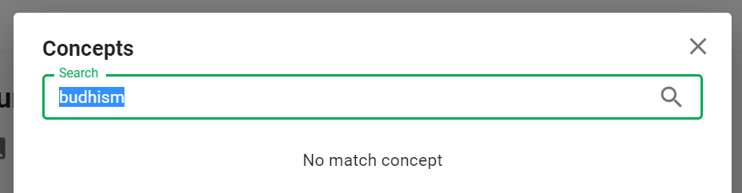
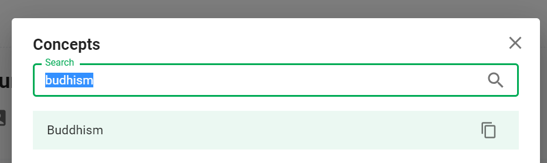
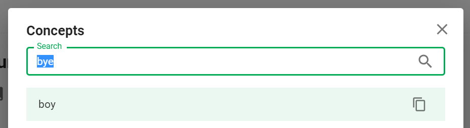

# Account Settings

Phần này mô tả tính năng **Account Settings**.

Click ```Settings``` tại menu người dùng.


## Tổng quan


1. General: Đổi thông tin như avatar, tên hiển thị...
2. Security: Đổi mật khẩu.
3. Setting: Các cài đặt khác.

## General tab



## Security tab



## Setting tab



Hiện tại chỉ có 1 cấu hình tại tab này, đó là *"Use Soundex Search when searching for concepts"*.

>**Soundex** is a phonetic algorithm for indexing names by sound, as pronounced in English. The goal is for homophones to be encoded to the same representation so that they can be matched despite minor differences in spelling. ([Wikipedia](https://en.wikipedia.org/wiki/Soundex))

Soundex search trong HUST PVO là 1 **cấu hình tìm kiếm nâng cao**, giúp bạn tìm kiếm các concept ngay cả khi bạn không nhớ rõ và nhập sai một vài ký tự vào ô tìm kiếm.

Đây là một ví dụ về tính năng này. Giả sử trong từ điển của bạn có concept *"Buddhism"*, nhưng khi tra cứu bạn lại nhớ nhầm và gõ là *"Budhism"*.

Nếu bạn không tích chọn checkbox ```Use Soundex Search...```, bạn sẽ không tìm thấy bất kỳ concept nào phù hợp với từ khóa tìm kiếm *"Budhism"*.



Khi bạn tích chọn checkbox ```Use Soundex Search...``` và tìm kiếm lại, bạn sẽ thấy concept *"Buddhism"* trong kết quả tìm kiếm.



Soundex search **không tốt trong mọi trường hợp**. Bạn có thể sẽ nhận được kết quả tìm kiếm không liên quan. Đây là một ví dụ khi bạn tìm kiếm *"bye"* trong khi từ điển của bạn không có *"bye"*, nhưng lại có *"boy"*




