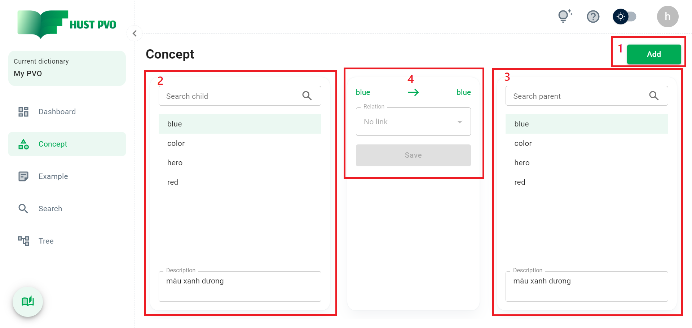
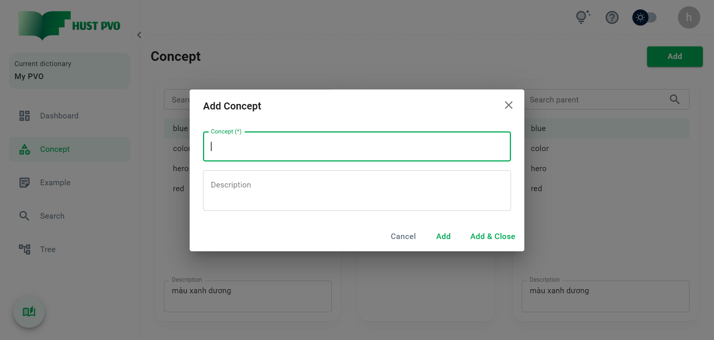
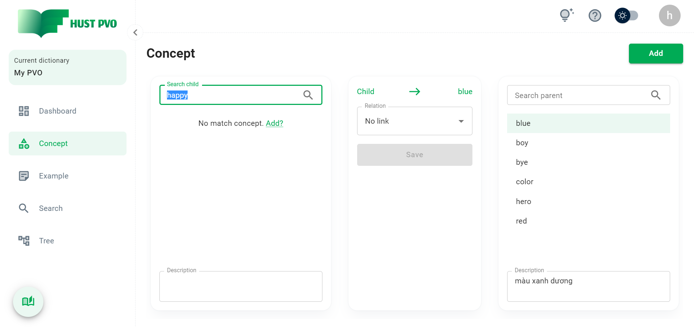
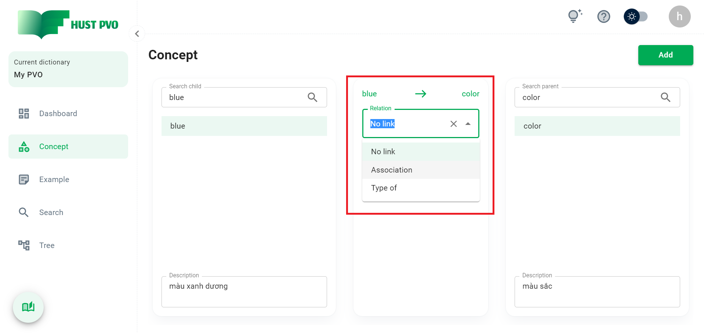
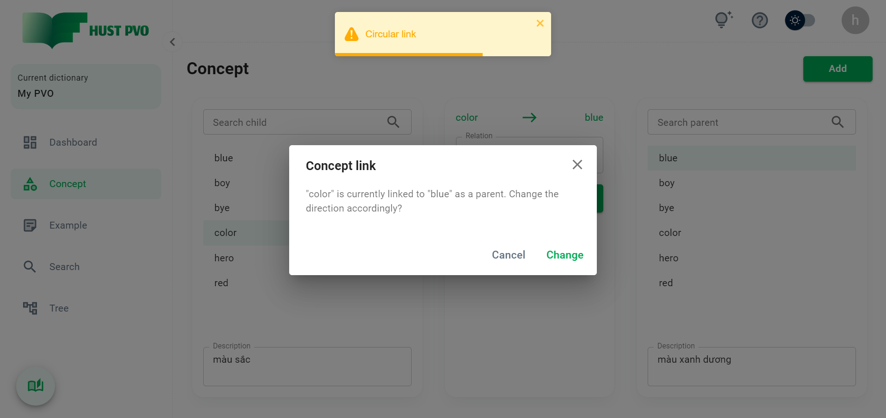
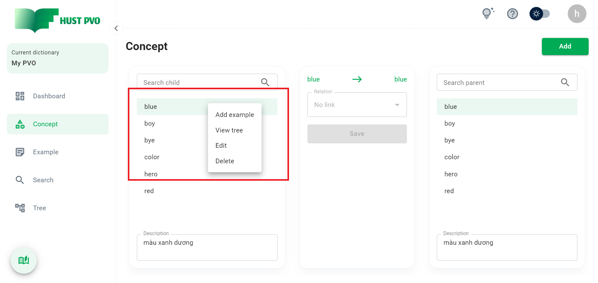

# Concept

Phần này mô tả màn hình **Concept**.

## Tổng quan



1. **Thêm 1 concept mới** vào từ điển hiện tại.

2. Ô tìm kiếm và kết quả tìm kiếm **concept con** (child concept).

2. Ô tìm kiếm và kết quả tìm kiếm **concept cha** (parent concept).

4. Combobox chọn và nút Lưu **liên kết giữa concept con và concept cha**.

:::tip
**Concept con** (Child concept) hay **Concept cha** (Parent concept) đều là concept. Chúng ta gọi nó là **con** hay là **cha** phụ thuộc vào hướng của liên kết.
:::

## Thêm concept mới



Nhập vào form, chú ý rằng trường Concept là bắt buộc nhập. Ngoài ra, concept không được phép trùng nhau trong 1 từ điển.

:::tip
Trường Concept được tự động focus để giúp bạn nhập liệu nhanh hơn.
:::

Chọn ```Add & Close``` để thêm mới và đóng hộp thoại.

Chọn ```Add``` để thêm và làm mới lại form để tiếp tục thêm concept. Đây là tính năng hữu ích giúp bạn thêm nhanh hàng loạt concept.

:::tip
Một concept sau khi thêm mới thành công sẽ **tự động xuất hiện** tại ô **tìm kiếm concept con**, giúp bạn thuận tiện tạo liên kết giữa các concept.
:::

## Tìm kiếm concept

Nhập từ khóa vào ô tìm kiếm để tìm **concept con** hoặc **concept cha**. Một concept được coi là khớp nếu nó chứa chuỗi tìm kiếm.

:::tip
Concept khớp tìm kiếm đầu tiên trong danh sách sẽ **tự động được chọn**.
:::

:::tip
HUST PVO cung cấp một cấu hình nâng cao, gọi là **Soundex search**. Mặc định, cấu hình này được tắt. Bạn có thể bật nó tại Account Setting. Chi tiết tính năng này sẽ được giới thiệu sau.
:::


Nếu không có bất kỳ concept nào khớp, bạn có thể thêm ngay chuỗi tìm kiếm thành concept mới, bằng cách nhấn ```Add``` (xem hình bên dưới).



## Thiết lập liên kết giữa 2 concept

Sau khi bạn chọn child concept và parent concept, bạn có thể thiết lập liên kết giữa chúng. Chú ý rằng, combobox chọn loại liên kết sẽ bị vô hiệu hóa nếu child concept hoặc parent concept chưa được được chọn, hoặc là child concept trùng với parent concept.

:::tip
*No link* không thực sự là một loại liên kết. Nó được sử dụng để **xóa bỏ** liên kết giữa hai concept. *No link* là giá trị liên kết **mặc định** giữa 2 concept.
:::




Sau khi chọn loại liên kết, bạn cần nhấn ```Save``` để lưu thiết lập. Nút ```Save``` mặc định bị vô hiệu hóa, và chỉ được kích hoạt nếu loại liên kết giữa 2 concept thay đổi.

:::danger

Bạn không thể tạo liên kết vòng (circular link). Nghĩa là, nếu child concept A liên kết tới parent concept B, bạn không thể tạo 1 liên kết từ B đến A.

:::



Nếu bạn nhấn ```Change```, liên kết cũ (từ A sang B) sẽ bị xóa, liên kết mới (từ B sang A) sẽ được lưu.

## Thao tác khác

Click chuột phải vào 1 concept trong danh sách tìm kiếm để mở hộp thoại.



1. **Add example**: chuyển đến màn hình Example và concept được chọn sẽ tự động hiển thị ở ô tìm kiếm Linked concept.
2. **View tree**: chuyển đến màn hình Tree và hiển thị cấu trúc cây của concept được chọn.
3. **Edit concept**
4. **Delete concept**


