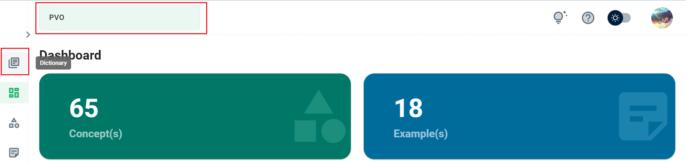
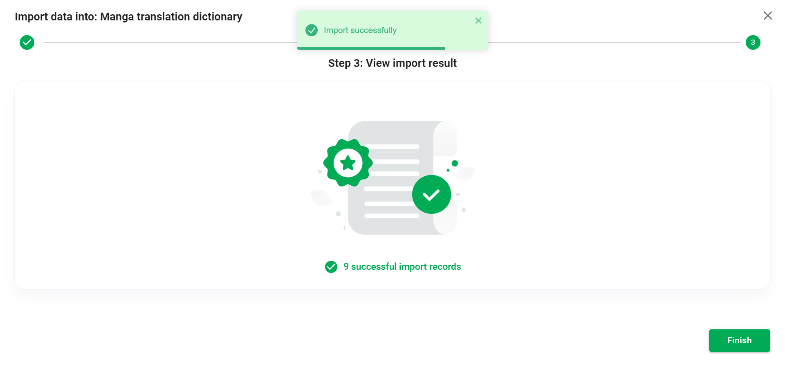
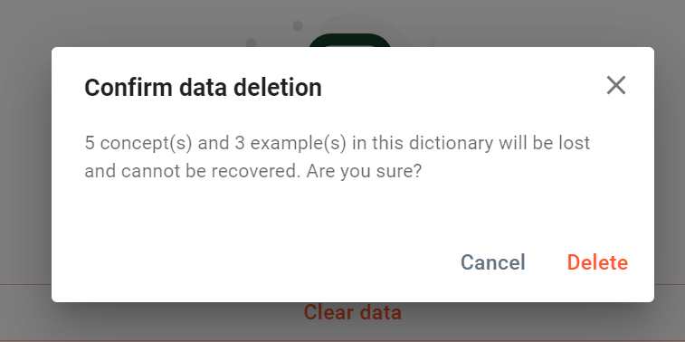

# Dictionary

Phần này mô tả màn hình **My Dictionaries**. Tính năng này cho phép bạn quản lý các từ điển từ vựng của mình.

Click ```Current dictionary``` để mở màn hình **My Dictionaries**.


Nếu bạn thu gọn sidebar, bạn có thể click nút ```Dictionary``` ở thanh menu bên trái, hoặc click ```Current dictionary``` ở thanh header.



## Danh sách từ điển

Mỗi từ điển trong danh sách được hiển thị với tên và thời điểm truy cập cuối.


Mặc định, danh sách được sắp xếp theo thời điểm truy cập cuối (từ mới đến cũ). Ngoài ra, bạn có thể chọn sắp xếp theo tên từ điển.

## Tạo từ điển mới

Mặc định, HUST PVO đã tạo cho bạn một từ điển có tên là *PVO*. Bạn có thể tạo thêm từ điển tùy theo nhu cầu cá nhân.

Click ```Create``` để mở hộp thoại ```Create Dictionary```.


```Dictionary name``` là trường bắt buộc. Ngoài ra, bạn không thể tạo 2 từ điển trùng tên.

Tại combobox ```Clone Data From```, bạn có thể chọn 1 từ điển nguồn để **sao chép dữ liệu** của từ điển đó sang từ điển mới.

## Hành động khác

Tại bất kỳ mục từ điển nào, hãy nhấp vào icon ở góc trên cùng bên phải để mở menu.


1. Load: Truy cập vào từ điển để sử dụng.
2. Edit: Sửa tên từ điển.
3. Import: Nhập khẩu dữ liệu từ excel vào từ điển.
4. Export: Xuất dữ liệu từ điển ra file excel.
5. Transfer: Sao chép dữ liệu của từ điển này, chuyển và gộp vào dữ liệu đã có của từ điển khác.
6. Delete: Xóa dữ liệu hoặc xóa từ điển.

### Load

Click ```Load``` tại menu, hoặc double-click 1 mục từ điển. Từ điển đó sẽ trở thành Current dictionary.

### Edit

Click ```Edit``` tại menu để mở hộp thoại.
Nhập tên từ điển mới (tên không được để trống và không được trùng với tên từ điển đã có).

### Import

Click ```Import``` tại menu để mở màn hình Import. Quá trình nhập khẩu gồm 3 bước.

:::danger
Nếu nhập khẩu thành công, tất cả dữ liệu hiện có của từ điển sẽ bị xóa.
:::

#### Bước 1 - Chọn file nhập khẩu


1. Tên của từ điển bạn đang làm việc.
2. Bước hiện tại.
3. Nút tải xuống mẫu nhập khẩu.
4. Vùng tải tệp lên.
5. Chuyển sang bước tiếp theo.

Để nhập khẩu, bạn cần **tải xuống tệp mẫu nhập khẩu do HUST PVO cung cấp** và cho dữ liệu vào tệp. Hoặc bạn có thể sử dụng **tệp dữ liệu đã xuất khẩu bằng tính năng Export của HUST PVO**.

:::danger
Nếu bạn **không** sử dụng tệp excel mà HUST PVO cung cấp, chúng tôi không thể xử lý dữ liệu của tệp đó. Bạn sẽ nhận được thông báo lỗi: *"Invalid file upload"* khi bạn chuyển sang bước 2.
:::

HUST PVO cung cấp tệp mẫu nhập khẩu ở định dạng excel. File này đã dựng sẵn cấu trúc giúp bạn nhập dữ liệu nhanh chóng, cũng như để HUST PVO dễ dàng xử lý khi bạn nhập khẩu.


Hình ảnh dưới đây là một ví dụ về nhập dữ liệu trong tệp mẫu nhập khẩu:


HUST PVO chỉ chấp nhận các tệp có định dạng excel, dung lượng dưới 5,2 MB và phải là tệp do HUST PVO cung cấp.


Click ```Next``` để chuyển sang bước 2.

#### Bước 2 - Kiểm tra dữ liệu


1. Tên của từ điển bạn đang thao tác.
2. Bước hiện tại.
3. Số lượng bản ghi hợp lệ và không hợp lệ.
4. Tải xuống tệp lỗi.
5. Bảng mô tả bản ghi không hợp lệ.
6. Quay lại bước 1.
7. Chuyển sang bước tiếp theo.

Nếu có bất kỳ bản ghi nào không hợp lệ, HUST PVO sẽ hiển thị mô tả trên bảng, đồng thời cho phép người dùng tải xuống tệp lỗi.

Hình ảnh dưới đây là ví dụ về một tệp lỗi. Các dòng lỗi sẽ được đánh dấu màu đỏ, kèm theo mô tả lỗi ở cột cuối cùng.


:::tip
Bạn có thể sửa tệp lỗi và sử dụng chính tệp đó để nhập khẩu lại (Không cần thay đổi định dạng màu chữ của dòng lỗi, không cần xóa mô tả lỗi ở cột cuối cùng).
:::

Click ```Next``` để thực hiện nhập khẩu.

Nếu từ điển bạn đang làm việc có dữ liệu, một hộp thoại thông báo sẽ xuất hiện yêu cầu bạn xác nhận. Click ```Accept continue``` để xóa dữ liệu cũ và nhập khẩu dữ liệu mới.


#### Bước 3 - Xem kết quả

Kết quả số bản ghi đã nhập khẩu thành công sẽ được hiển thị trên màn hình.



### Export

Click ```Export``` tại menu để mở hộp thoại Export Options.

Click ```Download``` để tải về tệp excel chứa dữ liệu xuất khẩu.

Click ```Send to email``` để yêu cầu HUST PVO gửi tệp xuất khẩu vào email của bạn.


### Transfer

Click ```Transfer``` tại menu để mở hộp thoại Transfer.


Bạn cần chọn một từ điển đích.

Giả sử từ điển nguồn là A, từ điển đích là B. Dữ liệu của A (bao gồm các concept, example, liên kết concept-concept, liên kết example-concept) sẽ được sao chép sang từ điển B. Những dữ liệu này sẽ được hợp nhất với dữ liệu đã có trong B.

Ví dụ: A chứa concept ***a1*** liên kết với concept ***a2***, B chứa concept ***a1*** liên kết với concept ***b2***, B không chứa concept ***a2***. Sau khi truyền dữ liệu từ A sang B, B chứa concept ***a1*** liên kết với concept ***a2*** và concept ***b2***.

HUST PVO cho phép bạn chọn: có xóa dữ liệu từ điển đích, trước khi nhận dữ liệu của từ điển nguồn hay không.

### Delete

Click ```Delete``` tại menu để mở hộp thoại Delete Options.


Có thể chọn ```Clear data``` (để làm trống từ điển) hoặc ```Delete dictionary```. Chú ý rằng bạn **không thể xóa Current dictionary** (nhưng có thể làm trống dữ liệu).

Nếu từ điển có dữ liệu, bạn sẽ thấy hộp thoại cảnh báo.



Click ```Delete``` để xác nhận hành động, hoặc click ```Cancel``` hủy thao tác.