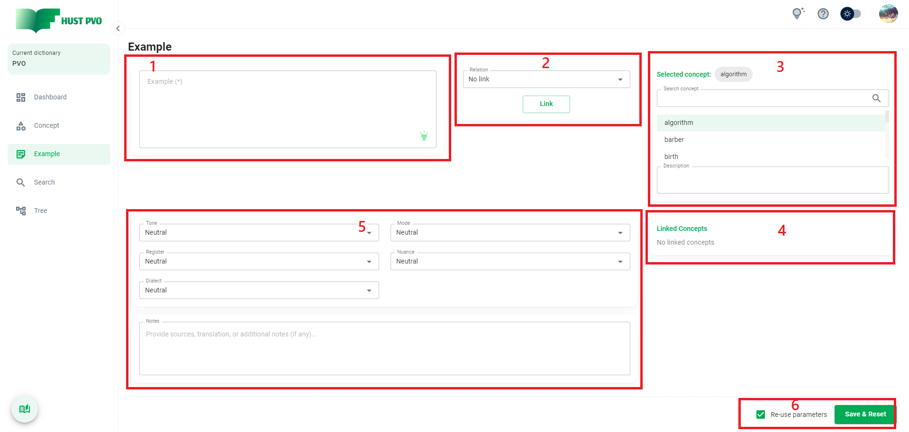
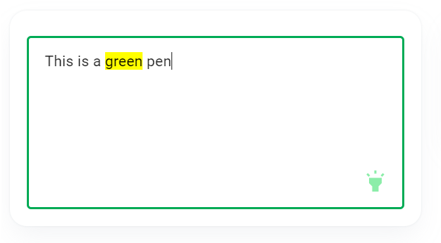
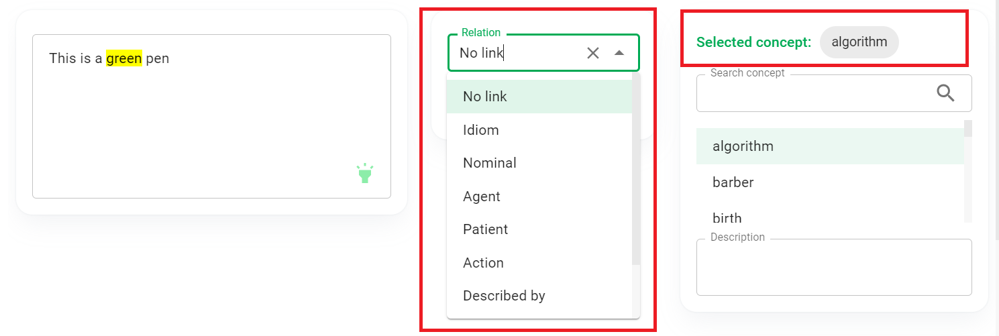
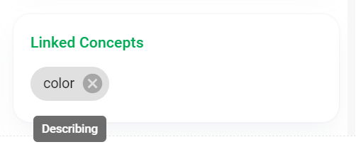

# Example

Phần này mô tả màn hình **Example**.

## Tổng quan



1. Nội dung Example.
2. Combobox cho phép chọn loại liên kết giữa example và concept.
3. Ô tìm kiếm và kết quả tìm kiếm concept.
4. Danh sách concept liên kết.
5. Các thuộc tính và ghi chú của example.
6. Nút ```Save``` và checkbox ghi nhớ tham số.

## Nội dung example

Nội dung Example là trường bắt buộc nhập, tối đa 1000 ký tự. Bạn **bắt buộc** phải **highlight** một phần hoặc tất cả nội dung example.

Bạn không thể thêm 2 example trùng nhau. Hai example được coi là trùng nhau nếu chúng giống nhau cả về nội dung và các phần highlight.

:::tip
Trường Exmple được **tự động focus** giúp bạn nhập dữ liệu nhanh chóng hơn.
:::



## Thiết lập liên kết giữa example và concept

Sau khi bạn chọn 1 concept trong danh sách tìm kiếm, bạn có thể chọn loại liên kết giữa example và concept.

:::tip
*No link* thực ra không phải 1 loại liên kết. Nó dùng để **xóa bỏ** liên kết giữa example và concept. *No link* là mối quan hệ **mặc định**.
:::



Click nút ```Link```, concept sẽ xuất hiện ở **danh sách Linked concept**. Nếu bạn di chuột qua(hover) một concept trong danh sách này, bạn sẽ thấy mối quan hệ đã được thiết lập.



To edit an established link, you can perform a concept search again or click on the corresponding concept in the list of linked concepts. Then you change the link type and click ```Link``` button to temporarily save the settings. You can change the link type to ***No link*** to remove the link.

Để chỉnh sửa một liên kết đã thiết lập, bạn có thể tìm kiếm lại concept, hoặc click vào concept tương ứng trong danh sách Linked concept. Sau đó, bạn thay đổi loại liên kết, và click ```Link``` để tạm thời lưu cài đặt. Bạn có thể thay đổi loại liên kết thành ***No link*** để xóa liên kết.

## Các thuộc tính và ghi chú của example

Bạn có thể chọn tone, mode, register, nuance và dialect của example. Các thuộc tính này giúp bạn xác định khi nào bạn nên sử dụng example này trong thực tế.

**Tone** bao gồm: *Neutral (**mặc định**), Informal, Formal, Slightly informal, Slightly formal*.

**Mode** bao gồm: *Neutral (**mặc định**), Spoken, Written*.

**Register** bao gồm: *Neutral (**mặc định**), Academic, Literature, Business, Law, Journalism, Medicine, IT, Other (Thêm mô tả chi tiết tại phần ghi chú)*.

**Nuance** bao gồm: *Neutral (**mặc định**), Old fashioned, Humorous, Oft positive, Oft negative*.

**Dialect** bao gồm: *Neutral (**mặc định**), American, British, Other (Thêm mô tả chi tiết tại phần ghi chú)*.

Ngoài các thuộc tính trên, bạn có thể cung cấp thêm mô tả vào trường **Notes**, như nguồn ví dụ, bản dịch,...

## Save & Reset

If the ```Re-use parameters``` checkbox is checked, the parameters you have set: tone, mode, register, nuance, dialect and notes will be preserved when the form is reset. Otherwise, all parameters will be reset to default.

Trước khi lưu, bạn có thể chọn chọn hoặc bỏ chọn checkbox ```Re-use parameters```. Sau đó click ```Save & Reset``` để thêm example.

Nếu checkbox ```Re-use parameters``` được chọn, các tham số bạn đã đặt: tone, mode, register, nuance, dialect và notes sẽ được giữ nguyên khi reset. Nếu không, tất cả các tham số sẽ được đặt lại về mặc định.

## Undeciced example

Một example không liên kết đến bất kỳ concept nào được phân loại là **Undecided example**. Bạn có thể tìm kiếm các ví dụ này bằng cách sử dụng tính năng ```Only search undecided examples``` trong màn hình Search.