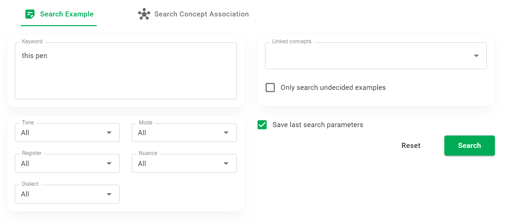

# Search

Phần này mô tả màn hình **Search**.

Màn hình này có 2 tab: **Search Example** và **Search Concept Association**. 

:::tip
Lần đầu tiên bạn truy cập màn hình này, tab **Search Example** mặc định sẽ được mở. Từ lần sau, tab truy cập lần cuối sẽ được mở.
:::

## Search Example

### Tiêu chí tìm kiếm



Bạn có thể sử dụng 1 hoặc nhiều tiêu chí để tìm kiếm các example được lưu trữ trong từ điển.

Với trường **Keyword**, bạn có thể nhập một vài ký tự hoặc từ khóa để tìm kết quả khớp với nội dung hoặc ghi chú của example.

Với combobox **Tone**, **Mode**, **Register**, **Nuance**, **Dialect**, giá trị mặc định là All (Tất cả). Bạn có thể thay đổi để tìm các ví dụ có giá trị thuộc tính tương ứng.

Với multiselect box **Linked concept**, bạn có thể chọn một hoặc nhiều concept, để tìm các example liên kết với các concept đó. Nếu bạn để trống ô này, tất cả các example sẽ được tìm kiếm.

Checkbox ```Only search undecided examples``` giúp bạn tìm **Undecided examples**. Nếu checkbox này được chọn, ```Linked concept``` sẽ bị vô hiệu hóa và các giá trị linked concept sẽ không được sử dụng để tìm kiếm. Mặt khác, ```Linked concept``` có giá trị, thì checkbox sẽ bị vô hiệu hóa (vì 1 example liên kết đến ít nhất 1 concept không thể là 1 Undecided example). Theo mặc định, checkbox không được tích chọn.

Click ```Search```, ứng dụng sẽ thực hiện tìm kiếm. Nếu checkbox ```Save last search parameters``` được chọn (theo mặc định, checkbox này được chọn), các tham số tìm kiếm sẽ được lưu cho các lần tìm kiếm tiếp theo.

Để khôi phục bộ tham số tìm kiếm mặc định, click nút ```Reset```.

### Kết quả tìm kiếm

Kết quả tìm kiếm example hiển thị dưới dạng danh sách. Nếu nội dung example quá dài, chỉ phần hightlight đầu tiên được hiển thị (cùng với một vài từ đứng trước và đứng sau).


Click 1 example trong danh sách, bạn sẽ thấy thông tin cụ thể ở phần ```Selected example```.


:::tip
Chỉ các thuộc tính có giá trị khác Neutral mới được hiển thị cụ thể.
:::

:::tip
Di chuột qua 1 concept ở phần ```Linked concept```, bạn sẽ thấy được loại liên kết đã thiết lập giữa concept đó và example được chọn.
:::

### Sửa và xóa example

Click icon bút chỉ tại 1 example trong danh sách kết quả tìm kiếm, hộp thoại Edit/Delete example sẽ xuất hiện.

## Search Concept Association

Tại tab này, bạn có thể chọn từ 1 đến 10 concept, để tìm kiếm các concept liên kết với các concept đã chọn.

:::tip
Trong tình huống thực tế, tính năng này giúp bạn tìm 1 concept mà không nhớ chính xác nó, chỉ nhớ một số concept liên quan đến concept muốn tìm.
:::

Kết quả tìm kiếm trả về là một danh sách các concept, được sắp xếp theo thứ tự mức độ liên quan. HUST PVO sử dụng 1 thuật toán để tính giá trị kích hoạt trên mạng liên kết ngữ nghĩa. Thuật toán này được tham khảo từ nghiên cứu của TS. Hồ Lê Vũ [(Ho Le Vu, 2006, tr. 24-30)](https://ttu-ir.tdl.org/handle/2346/10813).


Ngoài danh sách kết quả, HUST PVO còn cung cấp cho người dùng chế độ xem trực quan thông qua đồ thị.


:::tip
Bạn có thể thu nhỏ, phóng to, kéo và thả đồ thị. Bạn cũng có thể kéo và thả các nút/đỉnh của đồ thị.
:::

:::tip
Khi di chuột vào một đỉnh trên đồ thị, bạn sẽ thấy các cạnh liền kề và các đỉnh liền kề được tô sáng. Tương tự khi bạn di chuột vào một cạnh bất kỳ trên đồ thị.
:::


