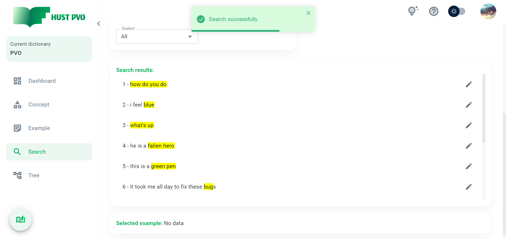
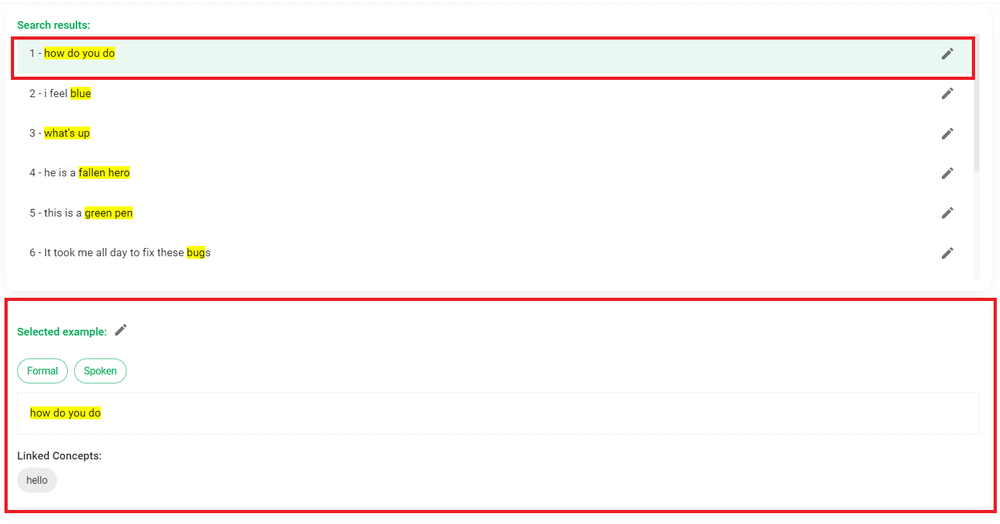

# Search

This section describes the **Search** screen.

This screen has 2 tabs: **Search Example** and **Search Concept Association**. 

:::tip TIP
The first time you access this screen, the default **Search Example** tab is opened. From next time, the last opened tab will be opened.
:::

## Search Example

### Search Criteria


You can use 1 or more criteria to search for examples stored in the dictionary.

With the **Keyword** field, you can enter a few characters or keywords to find a match with the example content or the example notes.

With combobox **Tone**, **Mode**, **Register**, **Nuance**, **Dialect**, default value is all. You can change to find examples with corresponding attribute values.

In the **Linked concept** multiselect box, you can select one or more concepts to find examples associated with those concepts. If you leave this box blank, all examples will be searched.

Checkbox ```Only search undecided examples``` helps you find **Undecided examples**. If this checkbox is checked, the ```Linked concept``` box is disabled and the linked concept values are not used for search. Otherwise, if the ```Linked concept``` box is not empty, the checkbox will be disabled (because an example that links to at least 1 concept cannot be an Undecided example). By default, the checkbox is unchecked.

When you click ```Search```, the app will perform the search. If checkbox ```Save last search parameters``` is checked (by default, this checkbox is checked), the search parameters will be saved for subsequent searches.

To restore the default set of search parameters, click the ```Reset``` button.

### Search Results

The example search results show up as a list. If the example content is too long, only the first highlighted part will be displayed (with a few words before and after).



Click an example in the list, you will see the specific information of that example in the ```Selected example``` section.



:::tip TIP
Only attribute values other than Neutral are explicitly listed.
:::

:::tip TIP
Hover into a concept in the ```Linked concept``` section you will see the type of established link.
:::

### Edit and delete example

Click the pencil icon at an example in the list of search results, the Edit and Delete example dialog box will appear.

## Search Concept Association

On this tab, you can select 1 to 10 concepts to search for concepts that link to the selected concepts.

:::tip Tip
In a real-life situation, this feature helps you to find a concept without remembering it exactly, but only remembering a few concepts related to the concept you want to find.
:::

The search results returned are a list of concepts, sorted in order of relevance. HUST PVO uses an algorithm to compute activation values on a semantically linked network. This algorithm is referenced from the research of Dr. Ho Le Vu [(Ho Le Vu, 2006, pp. 24-30)](https://ttu-ir.tdl.org/handle/2346/10813).


In addition to the list of results, HUST PVO also provides users with an intuitive view through the graph.


:::tip TIP
You can zoom out, zoom in, drag and drop the graph. You can also drag and drop nodes.
:::

:::tip TIP
When hovering a vertex on the graph, you will see the adjacent edges and adjacent vertices highlighted. Similar when you hover any edge on the graph.
:::


