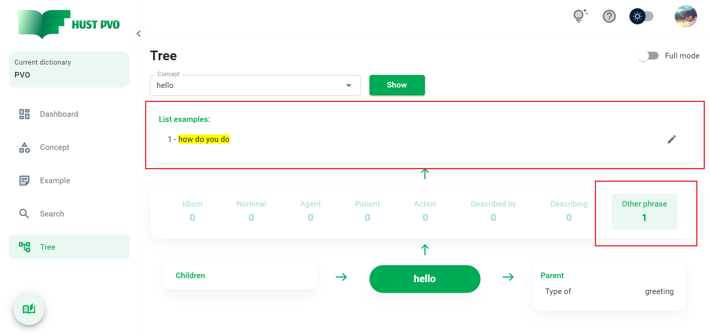
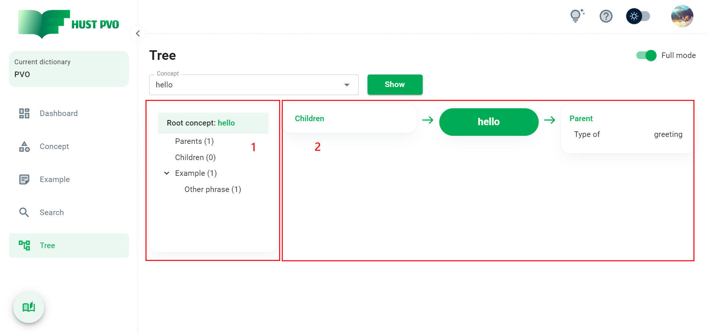

# Tree

Phần này mô tả màn hình **Tree**. Tính năng này cho phép bạn xem **cấu trúc cây của concept**.

## Tổng quan

Nhập hoặc chọn 1 concept (concept này được gọi là **root concept**) tại combobox ```Concept```. Click ```Show``` để hiển thị cây Concept tương ứng.

**Cây concept** bao gồm root concept, các child concept, các parent concept tương ứng của root concept và các example liên kết với root concept.

HUST PVO cung cấp 2 chế độ xem: **chế độ đơn giản** (**Simple mode**) và **chế độ đầy đủ** (**Full mode**).

## Simple mode


1. Root concept.
2. Danh sách child concepts của root concept.
3. Danh sách parent concepts của root concept.
4. Danh sách các mỗi quan hệ example-concept.
5. Danh sách examples tương ứng với mối quan hệ được chọn.

Click một mối quan hệ trong danh sách, bạn sẽ thấy danh sách example tương ứng hiện ra. Click icon bút chì để xem, sửa, xóa example.



:::tip
Trong danh sách các child concept và parent concept, bạn có thể click vào bất kỳ concept nào để chọn nó làm **root concept** và xem cấu trúc cây của concept đó.
:::

## Full mode

Ở chế độ xem đầy đủ, màn hình gồm 2 phần: cấu trúc cây thư mục và nội dung thư mục.

### Thư mục Root

Ảnh bên dưới là màn hình khi bạn ở thư mục **Root concept**.



1. Cấu trúc cây thư mục
2. Nội dung thư mục

### Thư mục Parents and Children

Khi bạn chọn xem thư mục **Parents** hoặc **Children**, kết quả hiển thị sẽ tương tự như hình bên dưới.


:::tip
Nếu bạn click 1 concept ở **(1)**, mạng liên kết concept-concept ở (2) sẽ thay đổi tương ứng mà (**không làm thay đổi Root concept**).
:::

Ví dụ: hình ảnh bên dưới là kết quả khi bạn click vào concept *greeting* trong thư mục Parents. Mạng liên kết concept-concept của *greeting* được hiển thị, trong khi root concept vẫn là *hello* (root concept sẽ được đánh dấu bằng màu xanh lá cây trong mạng liên kết concept-concept).


:::tip
Nếu bạn click vào một concept trong **(2)**, **root concept** sẽ được **thay đổi tương ứng** (giống như trong chế độ xem đơn giản).
:::

### Thư mục Example

Click 1 thư mục con của thư mục Example, danh sách các example tương ứng sẽ hiện ra.

Click 1 example để xem chi tiết.

Click icon bút chì để sửa hoặc xóa example.


