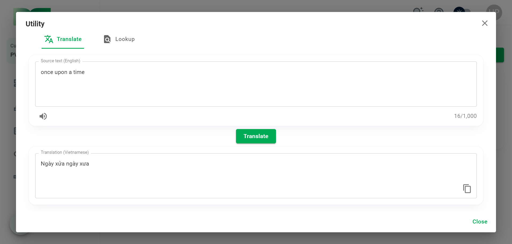
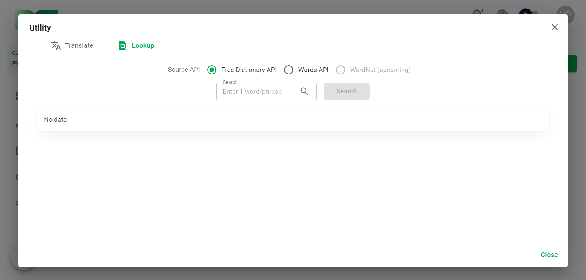
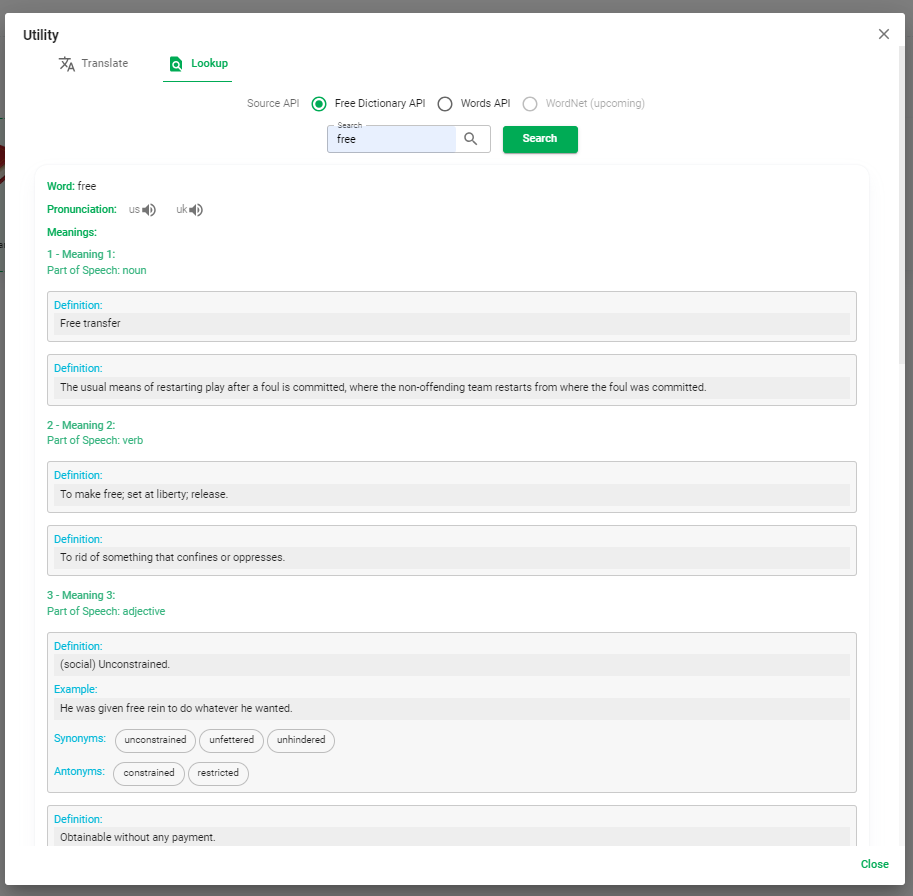
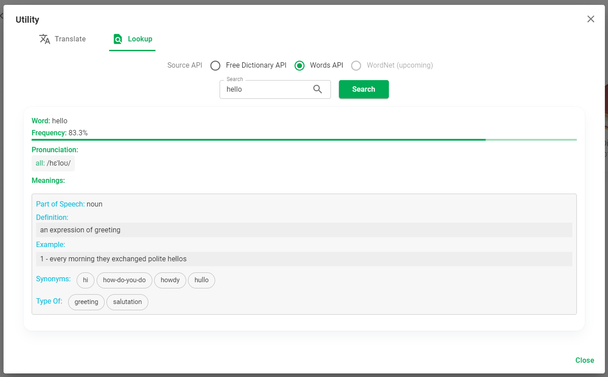

# Utility

Phần này mô tả các tính năng tiện ích của HUST PVO.

Click nút ```Utility``` ở thanh header để mở hộp thoại Utility.


Hiện tại HUST PVO cung cấp các tính năng tiện ích sau: Dịch văn bản (translation), Chuyển văn bản thành giọng nói (text-to-speech), Tra cứu từ điển hỗ trợ (lookup support dictionaries).

## Dịch văn bản và Chuyển văn bản thành giọng nói



Nhập vào ô ```Source text```. Click ```Translate``` để dịch văn bản, click ```speaker icon``` để nghe giọng đọc văn bản.

## Tra cứu từ điển hỗ trợ



HUST PVO sử dụng tài nguyên từ [Free Dictionary API](https://dictionaryapi.dev/), [Words API](https://www.wordsapi.com/) (sắp tới sẽ có thêm [WordNet](https://wordnet.princeton.edu/) ) như nguồn tham khảo cho người dùng.

Nhập 1 từ hoặc cụm từ và click ```Search``` để lấy dữ liệu từ nguồn tham khảo đã chọn.

Hình ảnh bên dưới là kết quả tìm kiếm cho từ khóa *free* với nguồn tham khảo là **Free Dictionary API**. Bạn sẽ nhận được cách phát âm, định nghĩa, ví dụ, từ đồng nghĩa, trái nghĩa... của từ *free*.



Hay với **Words API**, bạn sẽ nhận được kết quả như bên dưới với từ khóa *hello*:



:::tip
Bạn có thể click 1 dòng định nghĩa, 1 dòng ví dụ hoặc bất kỳ từ nào trong nhóm từ liên kết để **copy**.
:::
