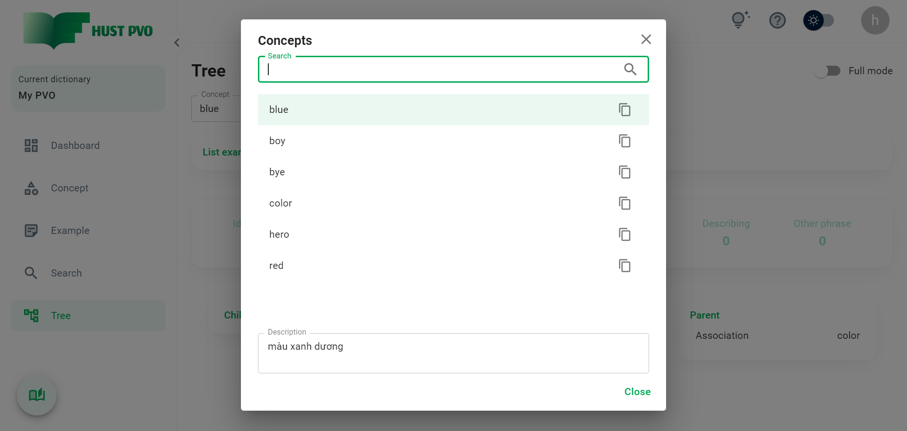

# View all concepts

Phần này mô tả tính năng **View all concepts**.

Tại bất kỳ màn hình nào, bạn có thể click nút ```View all concepts``` để xem tất cả concept lưu trong từ điển hiện tại. Nút này mặc định ban đầu nằm ở góc dưới cùng bên trái. Bạn có thể kéo thả nút ra đến vị trí khác trên màn hình.


Hộp thoại tìm kiếm concept xuất hiện. Bạn có thể click vào 1 concept trong kết quả tìm kiếm để copy, hoặc click chuột phải để mở hộp thoại hành động (tương tự chức năng ở màn hình Concept).



:::tip
Bạn có thể sử dụng phím tắt **Alt+C** để mở hộp thoại và **Ctrl+Q** để đóng hộp thoại.
:::


