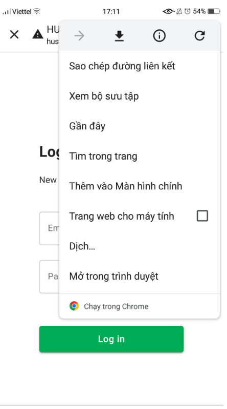
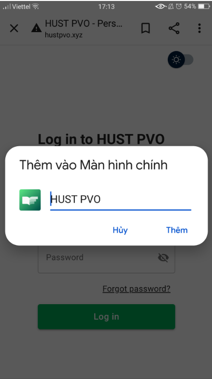

# Progressive Web App

## Responsive web design

HUST PVO được xây dựng với thiết kế đáp ứng. Bạn có thể sử dụng nó trên máy tính để bàn, máy tính xách tay, máy tính bảng, điện thoại di động... với giao diện và trải nghiệm người dùng tốt.


## Progressive Web App

HUST PVO là một [Progressive Web App](https://developer.mozilla.org/en-US/docs/Web/Progressive_web_apps).

>A progressive web app (PWA) is an app that's built using web platform technologies, but that provides a user experience like that of a platform-specific app.
>
>Like a website, a PWA can run on multiple platforms and devices from a single codebase. Like a platform-specific app, it can be installed on the device, can operate while offline and in the background, and can integrate with the device and with other installed apps. ([mdn web docs](https://developer.mozilla.org/en-US/docs/Web/Progressive_web_apps))

>Dịch: Một progressive web app (PWA) là 1 ứng dụng được xây dựng sử dụng công nghệ nền tảng web, nhưng cung cấp một trải nghiệm người dùng tương tự như ứng dụng platform-specific.
>
>Giống như 1 website, PWA có thể chạy đa nền tảng, đa thiết bị chỉ với 1 bộ mã code. Và giống như 1 ứng ứng platform-specific, nó có thể được cài đặt vào thiết bị, có thể hoạt động offline, hoạt động ở nền, và có thể tích hợp với thiết bị và các ứng ứng dụng khác được cài đặt trên thiết bị. ([mdn web docs](https://developer.mozilla.org/en-US/docs/Web/Progressive_web_apps))

### Desktop

Khi sủ dụng máy tính, trên trình duyệt, bạn có thể cài đặt HUST PVO app. 


Sau đó bạn có thể sử dụng HUST PVO như 1 ứng dụng máy tính.


### Mobile

Truy cập: https://www.hustpvo.xyz. Chọn ```Add to Home Screen```.





Sau đó bạn có thể sử dụng HUST PVO như 1 ứng dụng di động.


